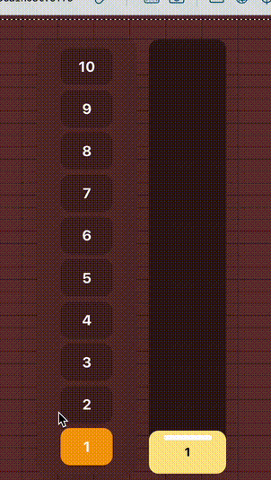

# Elevator Pitch  

*Problem solving exercise for candidates*

## Goal
Create a useElevator hook that encapsulates the logic for an elevator.  

## Example usage
```javascript
const { addRequest, currentFloor, queue } = useElevatorStore()
```


